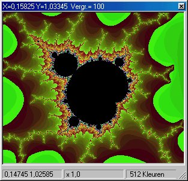



## Mandelbrot

### Description

With this code you can calculate the fabulous pictures obtained with the Mandelbrot-fractal. There is a popup-menu when clicking with the right mousebutton. Clicking with the left button in the image calculates a new picture.
 
### More Info
 

             |
---                |---
**Submitted On**   |2001-08-14 01:14:50
**By**             |[christine daniels](https://github.com/Planet-Source-Code/PSCIndex/blob/master/ByAuthor/christine-daniels.md)
**Level**          |Advanced
**User Rating**    |5.0 (15 globes from 3 users)
**Compatibility**  |VB 6\.0
**Category**       |[Graphics](https://github.com/Planet-Source-Code/PSCIndex/blob/master/ByCategory/graphics__1-46.md)
**World**          |[Visual Basic](https://github.com/Planet-Source-Code/PSCIndex/blob/master/ByWorld/visual-basic.md)
**Archive File**   |[Mandelbrot1046217102002\.zip](https://github.com/Planet-Source-Code/christine-daniels-mandelbrot__1-36778/archive/master.zip)

